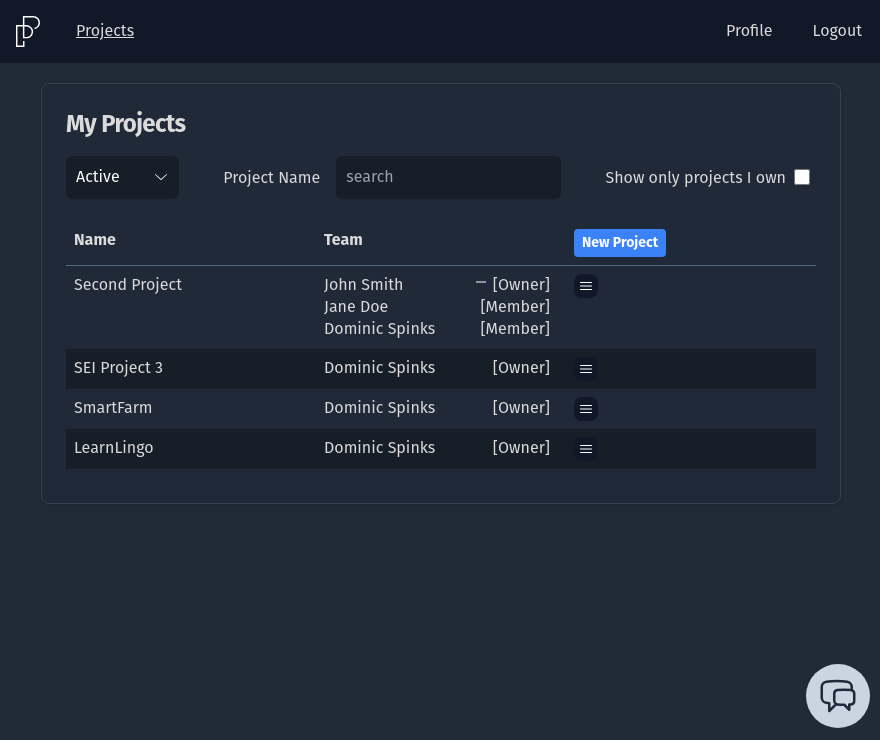
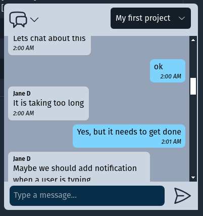

# ProjectPacer

ProjectPacer is a project management application designed to help small teams efficiently manage their projects. It provides features for user authentication, tracking project progress, and facilitating team communication through the included chat widget.

## Screenshots

_Login Screen_


_Project Screen_



_Chat Window_



## Technologies Used

-   React
-   React Router
-   Supabase
-   Tailwind CSS
-   Vite

## Approach

The development of ProjectPacer followed a structured approach:

1. **Setting up Supabase Database**: The initial step involved creating a Supabase account and setting up the database. Tables were added and modified as the development progressed.

2. **Routing and Page Creation**: Routing and placeholder pages were generated for each screen of the application to establish the basic structure.

3. **Content Population and Database Management**: Content was incrementally added to each page, and database access was managed to ensure smooth data retrieval and manipulation.

4. **UI Styling with Tailwind CSS**: The user interface was styled using Tailwind CSS to enhance usability and visual appeal.

## Installation and Setup

To run ProjectPacer locally, follow these steps:

1. Create an account and a database in Supabase.

    - Execute SQL queries from `_supabase-db.sql` to set up the necessary tables.
    - Retrieve the database URL and API key from the Supabase console.
    - Add the database URL and API key to the `.env` file.
        - VITE_SUPABASE_URL
        - VITE_SUPABASE_ANON_KEY

2. Install dependencies:

    ```
    npm install
    ```

3. Build the project:

    ```
    npm run build
    ```

4. Start the development server:

    ```
    npm run dev
    ```

    Alternatively, you can use `npm run preview` to preview the production build.

## User Stories

View the user stories on [Trello](https://trello.com/b/QgCuHT1t/project-tracker). ProjectPacer caters to the needs of small teams seeking efficient project management solutions.

## Wireframes

View wireframes on [Moqups](https://app.moqups.com/JU95FL0o9E7Owk2xx8mETPBqvWlBonKw/view/page/ad64222d5).
